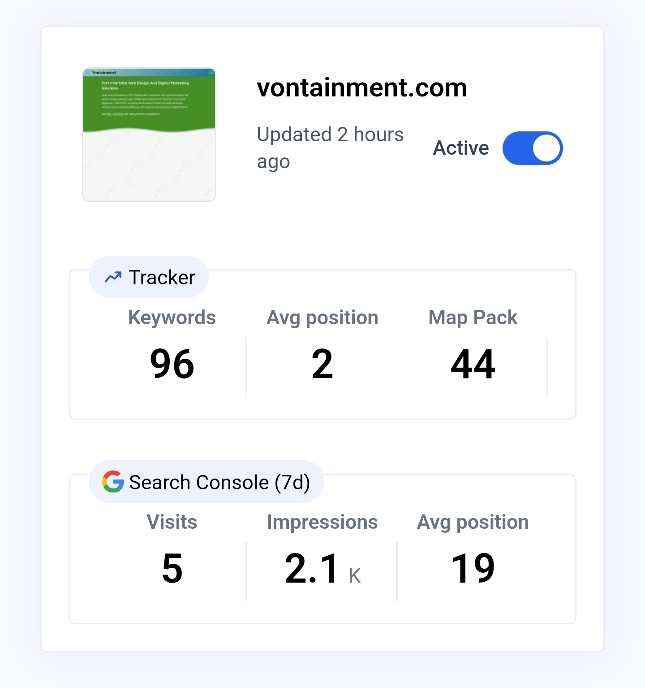

# SerpBear

## What is SerpBear?

SerpBear is a full-stack Next.js application that tracks where your pages rank on Google, enriches those rankings with Google Search Console and Google Ads data, and keeps stakeholders informed with scheduled email digests. The project ships as a production-ready Docker image, a conventional Node.js application, and a programmable REST API so you can integrate SERP intelligence wherever you need it.

I HAVE NOT CHECKED ALL SCRAERS YET! PLEASE LET ME KNOW YOUR EXPERIENCE?

> ### ✨ Why v-serpbear outperforms upstream SerpBear
>
> **1. Bug fixes & patches** – Hardened scrapers survive DOM and API drift, patched dependency regressions, and keep long-running jobs stable under high request volumes.
>
> **4. Configuration & flexibility** – Streamlined environment variables, CI-powered deployment workflows, and dynamic toggles for ValueSerp, SerpAPI, and other providers eliminate hardcoded defaults.
>
> **5. Security & modernization** – Modern Node.js support, removal of deprecated libraries, and stricter sanitisation guard against warning-laden installs and insecure runtime behaviour.
>
> **6. Error handling & observability** – Descriptive logs, layered retry logic, and adjustable debug levels make diagnosing scraper hiccups or API failures straightforward.
>
> **7. Performance & caching** – Smarter SERP caching, batched keyword refreshes, and fewer redundant calls drive faster crawls while reducing API spend.
>
> **8. Google Map Pack:** Now marks keywords that show up in the map pack.
>
> **9. White Labeling:** Easy whitelabling.
>
> **10. Per Domain Scraping:** Easily set scrapers per domain globally or both.
> 
[](https://app.codacy.com/gh/djav1985/v-serpbear/dashboard)   

---

## Quick links

- 📘 **Documentation:** <https://docs.serpbear.com/>
- 📜 **Changelog:** [`CHANGELOG.md`](./CHANGELOG.md)
- 🐳 **Docker Hub image:** <https://hub.docker.com/r/vontainment/v-serpbear>
- 🆕 **Current version:** v3.0.0 by [Vontainment](https://vontainment.com)
- 🛟 **Community support:** [GitHub Discussions](https://github.com/djav1985/v-serpbear/discussions)

---

### Core capabilities

- **Unlimited domains & keywords:** Organise an unrestricted number of tracked keywords across multiple sites.
- **Turn-key scraping integrations:** Connect a managed SERP data provider or bring your own proxy, then run high-volume organic rank checks with built-in retries.
- **Keyword research & ideas:** Pull search volumes and suggested keywords straight from your Google Ads test account.
- **Google Search Console enrichment:** Overlay verified impression and click data on keyword trends to see which rankings actually drive traffic.
- **Scheduled notifications:** Deliver branded summaries of ranking changes, winners/losers, and visit counts to your inbox. Each digest now opens with a tracker summary—styled like the dashboard card—that highlights total tracked keywords, the rolling average position, and, when supported by your scraper, how many queries sit inside the local map pack before diving into Search Console charts. The summary still derives the averages from the live keyword data, but now prefers any persisted domain map-pack totals and only falls back to keyword counts when that stat is unavailable so missing aggregates no longer drop either figure to zero.
  Mobile-friendly tweaks keep the tracker metrics aligned in columns on small screens so the compact layout mirrors the desktop digest.
- **Trusted domain stats:** Background jobs remain the single source of truth for domain aggregates. When those jobs have not yet persisted an average position or map-pack total, the API simply omits those fields instead of guessing from the latest keyword sample.
- **Local map-pack tracking:** When supported scrapers return the top-three local pack, SerpBear stores the flag and displays a stacked "MAP" badge beneath each keyword's country flag in the dashboard and a compact "MP" badge in email digests. The badge now suppresses the legacy sprite background so you will not see stray punctuation behind the green label. The domains overview also surfaces a "Map Pack" counter in the tracker summary when your chosen scraper exposes this data.
- **Mobile-ready progressive web app:** Install the dashboard on iOS or Android for quick monitoring on the go. The layout keeps consistent gutters while the top navigation now stretches truly edge-to-edge on phones—the helper offsets the body gutter and widens the bar so no stray right-side padding returns.
- **Adaptive desktop canvas:** Domain dashboards, Search Console insights, and the research workspace reuse a shared `desktop-container` utility that expands to 90 % of the viewport on large screens so wide monitors surface more data at once.
- **Focused loading states:** Keyword tables drive their own loading indicators, so the single-domain and research workspaces stay visible while data refreshes, and only the domains index keeps the full-page bootstrap overlay when first loading.
- **Robust API:** Manage domains, keywords, settings, and refresh jobs programmatically for automated reporting pipelines.

### Platform architecture at a glance

- **Frontend & API:** Next.js 15 application serving React pages and JSON endpoints from a single codebase.
- **Database:** SQLite (via a custom `better-sqlite3` dialect) by default, with optional external database support through Sequelize.
- **Background workers:** Node-based cron runner schedules scrapes, retries, Google Search Console refreshes, and notification emails according to configurable cron expressions and timezone settings.
- **Integrations:** Pluggable scrapers, Google Search Console, Google Ads, and SMTP providers are all controlled via environment variables.




> _If the animation above does not render, imagine a 15-second screen recording that walks through adding a domain, reviewing the keyword table, and exploring rank history charts. The UI mirrors what you will see after deploying the app._

---

## Getting started

### Option 1 – Docker Compose

```bash
git clone https://github.com/djav1985/v-serpbear.git
cd v-serpbear
cp .env.example .env
# edit .env with your credentials and scraping provider
docker compose up -d
```

The default compose stack maps `./data` to the container so your SQLite database and cached Search Console exports persist between updates.

### Option 2 – Node.js runtime

1. Install Node.js **20.18.1 or newer**, matching the version pinned in [`.nvmrc`](./.nvmrc).
2. Install dependencies with `npm install` (or `npm ci`).
3. Copy `.env.example` to `.env.local` and fill in the required keys.
4. **Apply database migrations:** `npm run db:migrate` to set up the SQLite database schema.
5. Start the development server via `npm run dev` or build and serve production assets with `npm run build && npm run start`.

> [!NOTE]
> Node.js 18 is no longer supported because core dependencies—such as `better-sqlite3`, `happy-dom`, and `cheerio`—now require Node.js 20+ runtime features.

### Database & migrations

- **SQLite files:** Live under `./data` by default; mount that directory when running inside containers to keep your historical data.
- **Docker deployments:** Database migrations run automatically from `entrypoint.sh` whenever the container starts. No manual intervention required.
- **Local Node.js development:** Use `npm run db:migrate` to apply schema changes manually (as shown in the setup steps above). Run `npm run db:revert` to roll back the most recent migration if needed.
- **Migration tooling:** The bundled Sequelize/Umzug tooling works for both approaches—Docker uses it internally, while local development exposes it through npm scripts.
- Keyword history rows now default to `{}`. The included migrations also backfill any legacy `'[]'` payloads so refresh jobs always receive plain objects.

---

## Configuration reference

All runtime behaviour is controlled through environment variables. The tables below summarise every supported option and note the defaults that ship with `.env.example`.

### Authentication & session management

| Variable | Default | Required | Description |
| --- | --- | --- | --- |
| `USER` | `admin` | ✅ | Initial dashboard username. Update after first login. |
| `PASSWORD` | `0123456789` | ✅ | Initial dashboard password. Update after first login. |
| `SECRET` | random string | ✅ | Cryptographic secret for cookie signing and JWT verification. Generate a unique value per deployment. |
| `APIKEY` | random string | ✅ | Server-side API key used to authenticate REST requests from external clients. |
| `SESSION_DURATION` | `24` | ✅ | Session lifetime (hours). Controls how long login cookies remain valid. |

### Application runtime

| Variable | Default | Required | Description |
| --- | --- | --- | --- |
| `NEXT_PUBLIC_APP_URL` | `http://localhost:3000` | ✅ | Public URL of your deployment. Determines callback URLs for integrations and absolute links in email digests. Falls back to `APP_URL` when set. |
| `APP_URL` | — | Optional | Optional server-side origin used when `NEXT_PUBLIC_APP_URL` is unset. Helpful for CLI scripts or cron contexts that cannot inject the public variable. |
| `NEXT_PUBLIC_SCREENSHOTS` | `true` | ✅ | Toggle keyword thumbnail capture in the UI. Set to `false` to fall back to favicons. |
| `NEXT_PUBLIC_WHITE_LABEL` | `false` | Optional | Enables white-label branding. When `true`, the platform name and logo come from the variables below. |
| `WHITE_LABEL_LOGO_FILE` | `branding-logo.png` | Optional | File name under `/app/data` for the custom logo. Use a 96×96px PNG, SVG, or WEBP asset for best results. |
| `NEXT_PUBLIC_PLATFORM_NAME` | `SerpBear` | Optional | Display name for the application and notification emails in white-label mode. |

> **Runtime branding.** Changes to `NEXT_PUBLIC_WHITE_LABEL`, `NEXT_PUBLIC_PLATFORM_NAME`, or your logo asset are loaded on-demand by the UI. Update the environment values or files and refresh the browser—no container rebuild is required.

### Google integrations

| Variable | Default | Required | Description |
| --- | --- | --- | --- |
| `SEARCH_CONSOLE_CLIENT_EMAIL` | — | Optional | Service account email with access to the Search Console properties you want to track. |
| `SEARCH_CONSOLE_PRIVATE_KEY` | — | Optional | Corresponding private key (remember to keep newlines escaped in `.env` files). |
| `ADWORDS_CLIENT_ID` | — | Optional | Google Ads OAuth client ID used for keyword volume and idea imports. |
| `ADWORDS_CLIENT_SECRET` | — | Optional | Google Ads OAuth client secret. |
| `ADWORDS_DEVELOPER_TOKEN` | — | Optional | Google Ads developer token for API access. |
| `ADWORDS_ACCOUNT_ID` | — | Optional | Google Ads manager account ID used when fetching keyword data. |

### Email notifications

| Variable | Default | Required | Description |
| --- | --- | --- | --- |
| `SMTP_SERVER` | — | Optional | SMTP host for transactional email. |
| `SMTP_PORT` | — | Optional | Port used when connecting to the SMTP host. |
| `SMTP_USERNAME` | — | Optional | Authentication username (if required by your provider). |
| `SMTP_PASSWORD` | — | Optional | Authentication password or app-specific token. |
| `NOTIFICATION_EMAIL_FROM` | — | Optional | Sender email address that appears in notification emails. |
| `NOTIFICATION_EMAIL_FROM_NAME` | `SerpBear` | Optional | Friendly sender name shown to recipients. Automatically switches to `NEXT_PUBLIC_PLATFORM_NAME` when white-label branding is enabled. |

SerpBear also accepts an optional **SMTP TLS certificate hostname** override from the Notification settings modal (or via the `smtp_tls_servername` field in the settings API). Whitespace and trailing dots are trimmed automatically before the value is passed to Nodemailer as the TLS `servername`, making it easier to work with proxies or shared SMTP endpoints whose certificates do not match the connection host.

### Cron scheduling

| Variable | Default | Required | Description |
| --- | --- | --- | --- |
| `CRON_TIMEZONE` | `America/New_York` | ✅ | IANA timezone used for all scheduled jobs. |
| `CRON_MAIN_SCHEDULE` | `0 0 0 * * *` | ✅ | Cron expression for daily scraping and Search Console refresh runs. |
| `CRON_FAILED_SCHEDULE` | `0 0 */1 * * *` | ✅ | Cron expression that retries failed scrapes. |
| `CRON_EMAIL_SCHEDULE` | `0 0 6 * * *` | ✅ | Cron expression for the daily notification email digest. |

All cron expressions are normalised at runtime—quotes and stray whitespace are stripped automatically before scheduling jobs.

### Monitoring & logging

| Variable | Default | Required | Description |
| --- | --- | --- | --- |
| `LOG_LEVEL` | `info` | Optional | Controls log verbosity for the structured logger. Accepts `error`, `warn`, `info`, `debug`, or `verbose`. |
| `LOG_SUCCESS_EVENTS` | `true` | Optional | Enables informational logs for successful API calls and authentication events. Set to `false` to capture only warnings and errors. |
| `NEXT_REMOVE_CONSOLE` | `false` | Optional | Removes `console.*` calls during production builds. When enabled, the Next.js compiler still preserves error logs. |

Set `ANALYZE=true` before running `next build` to generate a static bundle analysis report (`bundle-analyzer-report.html`) as configured in [`next.config.js`](./next.config.js).

---

## Supported SERP data providers

SerpBear integrates with several managed APIs in addition to a "bring your own proxy" option. The table below summarises their capabilities as implemented in the current codebase.

| Provider | Working | Pricing snapshot* | Geo targeting | Map Pack coverage | Organic results per request | API key header |
| --- | --- | --- | --- | --- | --- | --- |
| Custom proxy (`proxy`) | ? | Bring your own | Google default locale | No – organic listings only | 10 | None |
| Scraping Robot (`scrapingrobot`) | ? | Free tier (~5,000 req/mo) | Country-level | No – organic listings only | 10 | Query string `token` (or Authorization header) |
| ScrapingAnt (`scrapingant`) | ? | Pay-as-you-go | Country-level (select markets) | No – organic listings only | 10 | Header `x-api-key` |
| Serply (`serply`) | ? | Plans from $49/mo | City & region (supported markets) | **Yes** – extracts local map pack | Up to 100 | `X-Api-Key` + `X-Proxy-Location` |
| SpaceSerp (`spaceserp`) | ? | Lifetime + subscription plans | City-level | **Yes** – extracts local map pack | 10 | Query string `apiKey` |
| SerpApi (`serpapi`) | ✅ | Free 250/mo + Plans from $75/mo | City-level | **Yes** – extracts local map pack | 10 | Query string `api_key` |
| SearchApi (`searchapi`) | ✅ | Plans from $40/mo | City-level | **Yes** – extracts local map pack | 10 | Query string `api_key` |
| ValueSerp (`valueserp`) | ✅ | Pay-as-you-go 10,000 for $25 | City-level | **Yes** – extracts local map pack | 10 | Query string `api_key` |
| Serper (`serper`) | ✅ | Credit-based 50,000 for $50 | City-level | No – organic listings only | 10 | Query string `api_key` |
| HasData (`hasdata`) | ✅ | Free 1,000/mo + Plans from $49/mo | City-level | **Yes** – extracts local map pack | 10 | Header `x-api-key` |

\*Pricing details are indicative; confirm current pricing with each vendor before purchasing. All managed integrations authenticate with the headers or query parameters shown in the final column, exactly as implemented in the `/scrapers/services` directory.

### Per-domain scraper overrides

Every domain can opt into its own scraping provider without changing the global default. Open the **Domains** page, click a domain, and switch to the **Scraper** tab in the settings modal to reveal the override controls. Use the drop-down to choose a provider or revert to **System Scraper**, then supply the API key in the masked input when the provider requires one. Stored keys are encrypted before they are persisted, and the helper keeps the latest key for the same provider unless you explicitly clear it. Domains that keep the **System Scraper** option inherit the global configuration, matching how the refresh pipeline falls back when no override exists. Because overrides change the effective scraper per domain, they also influence whether a refresh job can run keywords in parallel—the pipeline checks each domain’s final scraper settings before opting into the faster path.

---

## Feature deep dive

### Keyword tracking workflow

1. **Add a domain** – supply the host name you want to monitor.
2. **Create keywords** – capture the query, target country, optional state/city pair (stored as a single location string), and device type (desktop/mobile).
3. **Run scrapes** – the cron worker queries your configured provider for the top 100 organic results and stores rank positions.
4. **Analyse trends** – interactive charts and tables surface historical rank, average position, and day-over-day change.
5. **Share insights** – export keyword data via the API or send scheduled email summaries to stakeholders.

### Google Search Console insights

- Authenticate with a service account and SerpBear will enrich each keyword with impression, click, and CTR metrics.
- Cached data refreshes automatically once per `CRON_MAIN_SCHEDULE` cycle (respecting `CRON_TIMEZONE`) and can be refreshed manually from the settings view.
- The Discover tab now disables Search Console keywords that are already tracked and its "select all" checkbox ignores those rows, mirroring the Google Ads ideas workflow to prevent duplicate tracking.
- Search Console data is optional; when credentials are missing the UI gracefully hides related panels.
- When credentials are present, manual refreshes and scheduled digests now always run the Search Console pipeline instead of skipping requests when the domain payload is unexpectedly falsy.

### Google Ads keyword research

- Connect a Google Ads test account to unlock keyword suggestions and historical volume data right inside SerpBear.
- The app exposes the same functionality through its REST API, making it easy to integrate with reporting pipelines.
- Already-tracked keyword ideas now render as disabled for the active device so research flows stay deduplicated when you revisit Google Ads suggestions.
- When Google Ads cannot supply any ideas that match your filters, the API now responds with a 404 and the UI shows a warning toast instead of a success banner so you can adjust the request immediately.
- Successful keyword idea imports no longer crash with a reference error and the research table now refreshes instantly because the React Query cache invalidation matches the underlying query key again.
- Email selected keyword ideas straight from the research table or a domain-specific ideas tab. The research view prompts you to choose a destination domain before sending, while domain idea pages automatically use their notification contacts. The outbound message includes a formatted table with monthly searches, trend history, and competition without touching the scheduled notification throttle.

### Loading states & accessibility

- The domains dashboard, single-domain workspace, and research area now share a full-viewport loader that blocks interaction until router state and React Query data have settled.
- Keyword, idea, and insight tables use a spinner-only placeholder with visually hidden labels so loading affordances stay consistent without repeating "Loading…" copy on screen.

### Notifications & reporting

- Email digests summarise rank gains/losses, highlight top movers, and include Search Console traffic data when available.
- Notification cadence is fully configurable through `CRON_EMAIL_SCHEDULE`. Disable SMTP variables to skip sending emails entirely.
- Trigger a manual run from the **Send Notifications Now** button in the Notification settings modal. Inline guidance and assistive-technology announcements walk through the prerequisites so teams can confirm SMTP credentials and email recipients immediately.
- `/api/notify` now reserves HTTP 401 strictly for authentication issues—misconfigured SMTP hosts return 400 and runtime delivery errors surface as 500 responses with descriptive messages for easier debugging.

---

## Development workflow

- **Node.js version:** Use `nvm use` to adopt the `20.18.1` runtime pinned in `.nvmrc`.
- **Install dependencies:** `npm install`
- **Code quality:**
  - `npm run lint` for ESLint (JavaScript/TypeScript).
  - `npm run lint:css` for Stylelint (global styles). The configuration now registers `@stylistic/stylelint-plugin`, so run `npx stylelint "**/*.{css,scss}"` when you need to lint additional component styles or verify indentation fixes.
  - Follow the repository's no-trailing-commas rule for object and array literals so configuration changes pass linting.
  - ESLint now caps line length warnings at 200 characters and reports function complexity over 60 as a warning; prefix unused arguments or errors with `_` to silence the new TypeScript-aware unused-variable checks.
- **Testing:**
  - `npm test` executes the Jest test suite using the `@happy-dom/jest-environment` adapter.
  - `npm run test:ci` mirrors the CI environment.
  - `npm run test:cv -- --runInBand` generates serialised coverage when debugging.
  - Regression specs assert the camelCase `mapPackTop3` keyword flag—update fixtures to keep that property present when adding new cases.
- **Database scripts:** `npm run db:migrate` / `npm run db:revert`.
- **Production build:** `npm run build` followed by `npm run start`.
- **UI patterns:** Add new icons through the `ICON_RENDERERS` map in `components/common/Icon.tsx` and rely on the exported keyword filtering helpers when building new table views to keep predicates shared and complexity low.
- **Side panels & dropdowns:** The `SidePanel` component now honours its `width` prop (`small`, `medium`, `large`) and `SelectField` respects `minWidth`, making it easier to tune layouts without hand-editing Tailwind classes.
- **Settings callouts:** Google Ads and Search Console settings surface the latest `settingsError` message above the form so operators see integration failures immediately.

---

## Contributing

We welcome community contributions! Please:

1. Fork and clone the repository.
2. Create focused commits with descriptive messages.
3. Add or update tests for any behavioural change.
4. Run `npm run lint` and `npm test` before opening a pull request.

Check [`AGENTS.md`](./AGENTS.md) for repository-wide contribution guidelines.

---

## License

SerpBear is distributed under the [MIT License](./LICENSE). Commercial support and custom integrations are available—open a discussion if you need help deploying the platform at scale.
